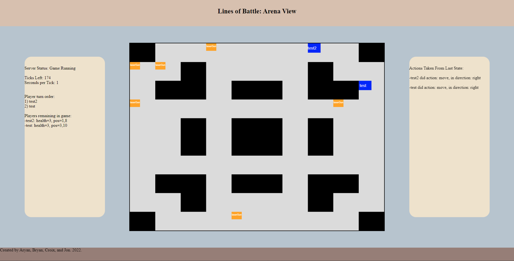

# Lines of Battle

Distributed Multiplayer Programming Game Environment

Fall 2022 Semester Project - IUPUI CSCI-53700: Introduction to Distributed Computing

## Project Components:

- [Report](Report.pdf)
- [Game Server](game-server/)
- [Visual Interface](arena-display/)
- [Example Client](example-client/)

## Team Members:

- **Bryan McClain** - Game server, example client
- **Jonathan Keesling** - Visual interface
- **Aryan Banyal** - Example client
- **Croix Gyurek** - Example client
